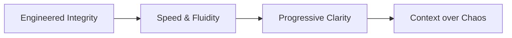
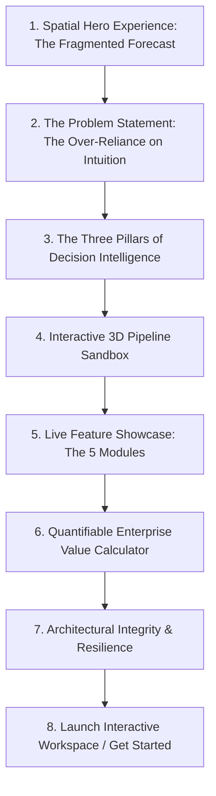
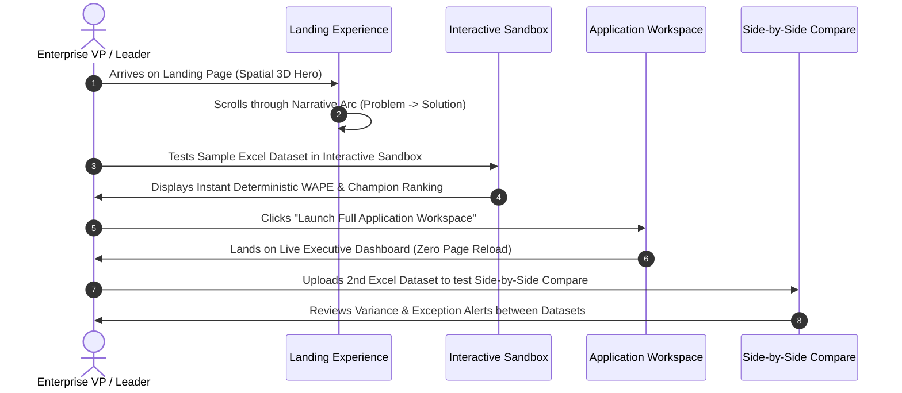
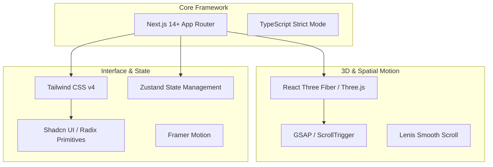
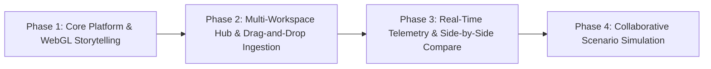
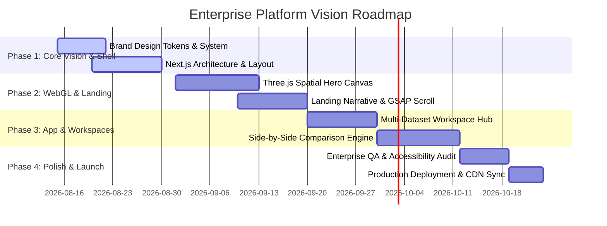

# Enterprise Forecast Decision Intelligence Platform
## Product Experience & Frontend Vision Blueprint

---

## 1. Executive Vision

The modern enterprise is drowning in dashboards yet starving for decision clarity. Legacy Business Intelligence (BI) platforms—such as Power BI, Tableau, and Qlik—were engineered for an era of passive historical reporting. They present static charts, isolated metrics, and disjointed grids that force executive leadership to manually infer risk, calculate variance, and negotiate model choices.

The **Enterprise Forecast Decision Intelligence Platform** represents a foundational paradigm shift:

$$\text{Legacy BI} = \text{Passive Data Visualization} \quad \longrightarrow \quad \text{Decision Intelligence} = \text{Deterministic Actionable Truth}$$

### The Core Architectural Axiom
> **Python = Truth. UI & LLM = Evidence & Narrative.**

1. **Deterministic Rigor**: All accuracy calculations (Winsorized WAPE, Bias, Wilcoxon confidence intervals, Hit-Rate, Volatility) and model champion selections are executed exclusively by Python analytics engines. No LLM or frontend code EVER infers or computes raw numbers.
2. **Exhaustive Evidence**: The user interface does not display raw numbers in isolation; it organizes data into multi-tier hierarchical tree rollups (`Global → Region → SubRegion → Offering → Queue`) with complete mathematical traceability.
3. **Narrative & Action**: The AI subsystem acts strictly as a provider-agnostic presentation layer, translating deterministic factual data into executive-ready anomaly alerts, risk breakdowns, and recommended actions.

---

## 2. Product Experience Philosophy

Our product design principles draw inspiration from world-class software platforms (Stripe, Vercel, Linear, Framer, Apple, Anthropic) while tailoring the experience strictly to enterprise supply chain and financial forecasting.



### Core Design Tenets

1. **Engineered Integrity over Decorative Fluff**: Every visual component, animation, and 3D node must serve a precise informational function. If a visual element does not clarify variance, highlight risk, or demonstrate model performance, it is removed.
2. **Speed as a Core Feature**: Enterprise software should feel instantaneously responsive. Interaction latency must remain under 16ms (60 FPS minimum). Filtering across 5,000+ queues must feel sub-second and fluid.
3. **Progressive Clarity**: Start with high-level executive confidence (The Inverted Pyramid), allow instant exploration of hierarchy drivers (Strategy Assessment), expose model head-to-head metrics (Model Champion), and detail 13-week operational variances (Business Context).
4. **Context over Chaos**: Never display a metric without baseline context. A WAPE of $14.2\%$ is meaningless without showing historical baseline WAPE ($18.5\%$), volume opportunity ($\$4.2\text{M}$), and regional variance contribution.

---

## 3. Brand Identity Direction

### Visual Personality
The brand identity conveys **calm precision, technical authority, and mathematical elegance**. It balances the clinical precision of high-frequency trading platforms with the warm, human legibility of modern editorial design.

### Color Palette Architecture
Preserving and elevating our signature palette:

| Token | Hex Value | Role & Applied Psychology |
|---|---|---|
| **Deep Midnight Navy** | `#101B33` / `#0B132B` | Dominant structural ground; communicates stability, depth, and enterprise security. |
| **Slate Gray** | `#64748B` / `#94A3B8` | Neutral structural elements, borders, and secondary labels. |
| **Electric Emerald / Teal** | `#2F6F63` / `#10B981` | Positive performance, ML model wins, accuracy improvements, active state highlights. |
| **Warm Gold / Amber** | `#C98A2C` / `#F59E0B` | Risk warnings, manual override alerts, baseline shortfall indicators. |
| **Crimson Rust** | `#DC2626` / `#EF4444` | High-risk alerts, model degradation, critical WAPE breach notifications. |
| **Crisp Light Ground** | `#F8FAFC` / `#FFFFFF` | Clean, high-contrast surface canvas for internal application views. |

### Typography Strategy
Dual-Type Hierarchy:
- **Primary Interface Font**: *Inter / Geist Sans* — Clean, hyper-legible neutral sans-serif designed for data-dense tables, numerical figures (tabular lining numerals `font-variant-numeric: tabular-nums`), and UI control labels.
- **Editorial & Header Accent Font**: *Newsreader / Instrument Serif* — Elegant serif reserved exclusively for high-level executive summary statements, key insight callouts, and landing section hero titles.

### Spacing & Grid Elevation
- **Spacing Grid**: Strict 4px/8px incremental grid.
- **Elevation System**: Multi-layered depth using subtle backdrop blur filters (`backdrop-filter: blur(12px)`), zero-spread ambient shadows, and $1\text{px}$ semi-transparent borders (`border: 1px solid rgba(255,255,255,0.1)`).

---

## 4. Landing Page Strategy

### Positioning Paradigm: Replacing the BI Status Quo
The public landing page is not a marketing Brochureware page; it is an **Interactive Product Experience**. It targets two primary enterprise personas simultaneously:
1. **C-Suite & VP of Operations/Supply Chain**: Seeking immediate accuracy lift, risk reduction, and dollar-denominated volume opportunity.
2. **Data Science & Analytics Leadership**: Seeking statistical transparency, model champion validation, and elimination of manual forecast override biases.

### The Opening Question
The landing hero immediately confronts the visitor with the core operational reality:
> **"Why are 68% of enterprise forecasts overridden manually despite millions invested in ML models?"**

Followed by the platform solution:
> **Forecast Decision Intelligence**: Unifying deterministic Python analytics, automated model champion ranking, and 13-week business context into a single enterprise platform.

---

## 5. Storytelling Flow

The landing page moves through an intentional narrative arc designed to build trust and demonstrate superiority over standard reporting.



### Storyboard Breakdown

1. **Spatial Hero Experience**:
   - An interactive 3D WebGL particle stream representing 5,000+ raw weekly forecast streams.
   - As the user scrolls, the chaotic particle streams converge deterministically into structured, glowing hierarchy nodes.
2. **The Problem Statement**:
   - Side-by-side comparison of "Legacy BI Chaos" (static bar charts, hidden errors, manual spreadsheets) vs. "Decision Intelligence" (automated ML vs. Manual champion ranking).
3. **The Three Pillars**:
   - **Pillar 1: Mathematical Truth** (Winsorized WAPE, Wilcoxon CIs).
   - **Pillar 2: Business Context** (13-week baseline actuals, shortfall heatmaps).
   - **Pillar 3: AI Narrative** (Provider-agnostic summaries, instant exception alerts).
4. **Interactive 3D Pipeline Sandbox**:
   - Visitors can drag a sample Excel file directly onto the 3D WebGL canvas or click a demo toggle to watch raw rows transform into live rollup hierarchies in real-time.
5. **Live Feature Showcase**:
   - Interactive preview of the 5 core dashboard modules: Executive Overview, Strategy Assessment, Model Champion, Business Context, and Anomaly Detection.

---

## 6. User Journey Map



---

## 7. Information Architecture (IA)

The information architecture cleanly divides public marketing narrative from active application execution.

```text
Enterprise Platform Site Architecture
│
├── 🌐 Public Marketing & Landing Experience (landing.html / /)
│   ├── Hero Spatial Experience (3D Pipeline)
│   ├── Problem & Solution Storytelling
│   ├── Interactive Feature Showcases
│   ├── Enterprise Value Calculator
│   ├── Technology & Security Specs
│   └── Documentation & API Guide
│
├── 🚀 Application Workspace Hub (portal.html / /workspace)
│   ├── Active Workspace Sessions (Dataset Gallery)
│   ├── Drag-and-Drop Dataset Ingestion
│   ├── Session Metadata & Tagging
│   └── Multi-Dashboard Launch Controls
│
├── 📊 Executive Application Dashboard (index.html / /dashboard)
│   ├── Executive Overview (KPI Cards, WAPE Buckets, Volume Concentration)
│   ├── Strategy Assessment (Hierarchical Tree Rollup: Global -> Queue)
│   ├── Model Champion (Radar Charts, Head-to-Head Cards, Scorecards)
│   ├── Business Context (13-Week Actuals, Rule Alerts, Shortfall Heatmap, Waterfall)
│   └── Anomaly Detection (Historical Volatility & Outliers)
│
└── ⚡ Side-by-Side Comparison Workspace (compare.html / /compare)
    ├── Dual Dataset Selector (Dataset A vs Dataset B)
    ├── Comparative KPI Variance Cards
    ├── Dual Hierarchy Drill-Down Alignment
    └── Variance Delta Heatmap
```

---

## 8. Navigation Strategy

### Unified Global Navigation Bar
The top header provides seamless, fluid transitions between marketing storytelling, workspace management, and active application analysis.

```text
[ 🔷 FORECAST INTELLIGENCE ]   Product   Architecture   Value   Docs   │   [ 📁 Workspaces (2) ]   [ ⚡ Compare ]   [ Launch App → ]
```

### Multi-State Routing Strategy
1. **Landing Mode**: Displays full-page smooth scrolling marketing story with WebGL spatial canvas in background.
2. **Workspace Mode**: Slides in a semi-transparent floating glass portal showing loaded datasets (`Q3 Operational Forecast`, `ML Benchmark Run`).
3. **Active App Mode**: Full-screen application layout with left navigation rail (`Exec`, `SA`, `MC`, `BC`, `AD`) and top dataset pill dropdown (`[ Active: Q3 Operational Forecast ▼ ]`).
4. **Compare Mode**: Expands into a dual-pane layout displaying Dataset A on the left and Dataset B on the right.

---

## 9. Motion & Animation Philosophy

Motion is used strictly to **encode spatial relationships, convey data hierarchy, and guide attention**.

### Spatial WebGL Experience (Three.js / React Three Fiber)
- **Hero Canvas**: A subtle 3D particle field representing raw data points flowing through a non-Euclidean pipeline.
- **Scroll Synchronization**: Scrolling down the page shifts the WebGL camera smoothly from an expansive overview of raw data streams down into a tight focus on a glowing, structured hierarchy node.
- **Performance Guarantee**: Built using GPU-instanced meshes (`InstancedMesh`) to ensure rock-solid 60 FPS performance even on integrated laptop GPUs. Falls back gracefully to 2D CSS ambient canvas on mobile or low-power devices.

### Layout Choreography & Micro-Interactions (Framer Motion / GSAP)
- **Page Transitions**: Smooth layout morphing (`layoutId` shared element transitions) when moving between Landing Story and Application Workspace.
- **Data Filtering Animations**: When applying hierarchy filters, grid items do not abruptly jump; they use spring physics (`stiffness: 300`, `damping: 30`) to re-arrange smoothly into position.
- **Hover Micro-Interactions**: Subtle 3D elevation shifts (`transform: translateY(-2px)`), glow intensity increases on active risk badges, and smooth tooltip fade-ins (`duration: 0.15s`).

---

## 10. Dashboard Integration Strategy

The landing experience smoothly transitions visitors directly into the active dashboard workspace without abrupt page refreshes.

```mermaid
graph LR
    A[Landing Page Sandbox] -->|Click "Explore Live Demo"| B[Smooth Camera Zoom Into Workspace Canvas]
    B --> C[Header Transforms into Active Dataset Selector]
    C --> D[Left Navigation Rail Unfolds Smoothly]
    D --> E[Full Executive Dashboard Ready for Exploration]
```

### Instant Excel Drag-and-Drop Hook
Visitors on the landing page can drag an Excel file directly anywhere onto the screen:
1. The 3D WebGL hero canvas animates a "Data Receiving" pulse.
2. The Python analytics engine processes the file in real-time (via WebAssembly client-side parser or FastAPI endpoint).
3. The landing narrative dissolves smoothly into the full live executive dashboard populated with their uploaded data.

---

## 11. Enterprise UX Principles

1. **High Data Density with Zero Visual Noise**: Information-dense tables and hierarchy trees use micro-typography, crisp $1\text{px}$ borders, and tabular lining numerals so executives can scan thousands of metrics effortlessly.
2. **Keyboard-First Navigation**: Full keyboard shortcut support:
   - `G + E`: Go to Executive Overview
   - `G + S`: Go to Strategy Assessment
   - `G + M`: Go to Model Champion
   - `G + B`: Go to Business Context
   - `/`: Focus search & filter bar
   - `Cmd/Ctrl + U`: Open Excel Upload Modal
   - `Cmd/Ctrl + C`: Toggle Side-by-Side Compare Mode
3. **Accessibility (WCAG 2.1 AA Compliant)**: High-contrast color ratios ($> 4.5:1$), explicit ARIA roles, full screen-reader label coverage, and visible focus rings (`ring-2 ring-teal`).

---

## 12. Recommended Frontend Technology Stack



### Technology Breakdown & Justification

| Technology | Where It Should Be Used | Where It Should NOT Be Used | Justification |
|---|---|---|---|
| **Next.js 14+ (App Router)** | Core application framework, static landing pages, server-side API proxy routes. | Isolated client-side canvas components that don't need SSR. | Delivers sub-second initial load speeds (SSR/SSG), automatic code splitting, and enterprise SEO. |
| **Three.js / React Three Fiber** | Hero section 3D spatial particle stream, 3D pipeline visualization. | Standard UI cards, data tables, or simple chart containers. | Creates an unforgettable enterprise first impression while maintaining 60 FPS performance via WebGL. |
| **GSAP + Lenis** | Smooth scroll hijacking on landing story, complex timeline choreography. | Simple UI hover states or dropdown toggles (use CSS/Framer Motion). | Provides silky smooth inertia scrolling and exact frame-accurate camera movement bound to scroll position. |
| **Framer Motion** | UI layout transitions, dynamic list re-ordering, tab switching, slide-over drawers. | Continuous 3D WebGL render loops. | Declarative, spring-physics layout animations for React components. |
| **Tailwind CSS v4** | Universal styling layer, design token implementation, responsive layouts. | Dynamic runtime inline CSS calculations (use CSS variables). | Zero runtime overhead, utility-first consistency, built-in dark mode token management. |
| **Shadcn UI + Radix** | Accessible UI primitives (Dropdowns, Dialogs, Tooltips, Tabs, Accordions). | Heavy pre-styled monolithic component frameworks (e.g. Material UI). | Unstyled, fully accessible, headless components that match our exact design system. |
| **Zustand** | Global dashboard state (Active dataset, filter selections, comparison targets). | Local component hover/open state (use `useState`). | Tiny ($1\text{KB}$), ultra-fast state management without React Context re-render bottlenecks. |

---

## 13. Future Expansion Strategy



1. **Collaborative "What-If" Scenario Modeling**: Allow executives to adjust volume assumptions on hierarchy nodes (e.g. "+15% EMEA Demand") and simulate forecast impact across ML vs Manual models in real-time.
2. **Real-Time Streaming Telemetry**: Connect to live enterprise ERP/WMS systems (SAP, Oracle, Blue Yonder) via WebSockets to stream weekly actuals continuously.
3. **Automated Executive Briefing Generator**: Export multi-page executive PDF pitch decks and Teams/Slack summary cards generated directly from Python analytics.

---

## 14. Risks & Trade-offs

| Risk Area | Potential Impact | Mitigation Strategy |
|---|---|---|
| **WebGL Heavy Bundle Size** | Initial page load slowdown on slow connections. | Lazy load Three.js canvas components asynchronously (`next/dynamic` with `ssr: false`). Show lightweight CSS ambient gradient while 3D bundle loads. |
| **GPU Performance Variation** | Framerate drops on low-end integrated graphics. | Implement dynamic quality scaling: detect FPS drops below 45 FPS and reduce particle counts or disable anti-aliasing automatically. |
| **Data Overwhelm** | First-time executives feeling lost in 5,000+ queue details. | Enforce strict Inverted Pyramid layout: always present high-level confidence scores first before exposing hierarchy drill-downs. |

---

## 15. Conceptual Implementation Roadmap



---

### Executive Summary & Final Vision Statement
This vision transforms the **Enterprise Forecast Decision Intelligence Platform** from a standard reporting application into an **industry-defining decision platform**. By combining deterministic Python analytical truth, sophisticated Three.js spatial storytelling, ultra-fast Next.js architecture, and seamless multi-dataset workspace management, the platform establishes an unprecedented standard for enterprise software excellence.
