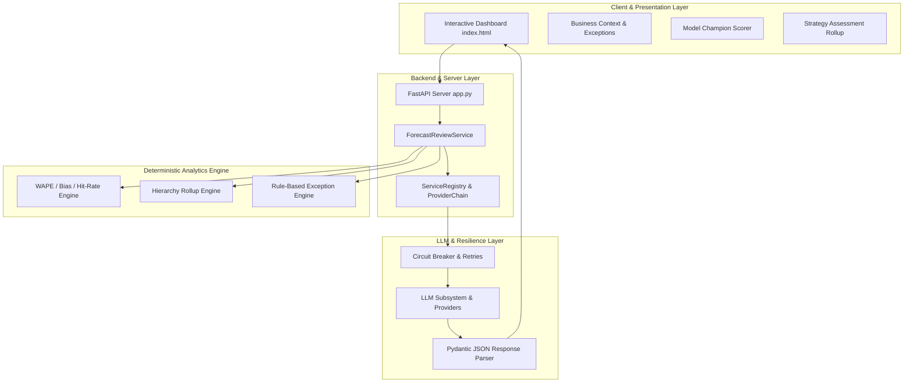

# Forecast Intelligence & Business Context System

## Project Overview

The **Forecast Intelligence & Business Context System** is an enterprise-grade, API-backed analytics application and interactive executive dashboard. It evaluates machine learning (ML) and manual baseline forecasts, calculates volume-weighted accuracy (WAPE, Bias, Hit-Rate, Stability), detects anomalies, and generates deterministic decision support reviews.

The core operational paradigm of the system is:
> **Python = Truth**  
> **UI & LLM = Evidence & Narrative**

All calculations, statistical rollups, model scorecards, and exception alerts are computed deterministically by Python. The presentation layer displays evidence through a sleek interactive dashboard, while the LLM subsystem provides management-ready narratives without altering facts.

---

## Dashboard Key Features & Modules

The application features a modern, responsive single-page web app (`index.html` / `dashboard_final.html`) featuring five core modules:

1. **Executive Overview**: High-level KPI summary cards (Total Offered Volume, ML WAPE, Manual WAPE, Volume-Weighted Opportunity), WAPE distribution buckets, and volume concentration metrics.
2. **Strategy Assessment (SA)**: Hierarchical tree rollup with interactive drill-down navigation (`Global → Region → SubRegion → Offering → Forecast Name`), queue-level detail tables, performance filters, and clickable risk indicators.
3. **Model Champion (MC)**: Head-to-head comparison cards (`Champion vs. Runner-Up`), 4-axis radar metrics (Accuracy, Hit-Rate, Bias, Stability), composite score contributions, and model selection scorecards.
4. **Business Context (BC)**: Real-time 13-week actuals vs. historical baseline, **Automated Exception Alerts** (deterministic rule-based anomaly detection), shortfall concentration heatmap (`Where Is the Shortfall Concentrated?`), and regional waterfall variance charts (`Why: Baseline → Actual, by Region`).
5. **Cascading Filter System**: Hierarchical multi-select filters ensuring strict tree alignment across Region, SubRegion, Country, Offering, Fiscal Week, Channel, and Classification.

---

## System Architecture



---

## Clean Repository Structure

```text
forecast_intelligence/
├── index.html                  # Primary Live Interactive Dashboard
├── dashboard_final.html        # Standalone Latest Dashboard Bundle
├── app.py                      # FastAPI Backend Application Server
├── requirements.txt            # Python Dependencies
├── package.json                # Web Project Configuration
├── README.md                   # Project Documentation
├── .gitignore                  # Git Exclusion Rules
├── docs/                       # Specifications & Architecture Documentation
│   ├── Enterprise_Forecast_Dashboard_Spec.md
│   ├── Current_Engine_Policy_Specification.md
│   ├── HANDOVER_DOCUMENT.md
│   └── design_system.md
├── scripts/                    # Core Data Extraction & Pipeline Scripts
│   ├── generate_dashboard.py
│   ├── extract.py
│   ├── audit_metrics.py
│   └── dev_tools/              # Developer Check & Verification Tools
├── legacy/                     # Archived Prototypes & Backup JS/HTML
├── api/                        # FastAPI REST Endpoint Routes
├── analytics/                  # Mathematical, Statistical & Drift Engines
├── services/                   # Business Logic, Storage & Resilience Layer
└── llm/                        # Provider-Agnostic LLM Integration
```

---

## Running Locally

### 1. Launch local dashboard web server
Run the Python HTTP server to serve the live dashboard:
```bash
python -m http.server 8000
```
Then open your browser and navigate to:
```text
http://localhost:8000/
```

### 2. Launch FastAPI backend application
To start the RESTful backend API:
```bash
uvicorn app:app --reload --port 8000
```
Access the interactive API documentation at:
```text
http://localhost:8000/docs
```

---

## Development & Verification

Execute the test suite to verify analytics parity and API resilience:
```bash
pytest tests/
```
To test deterministic model scoring and verification scripts:
```bash
python scripts/dev_tools/verify_infrastructure.py
```

