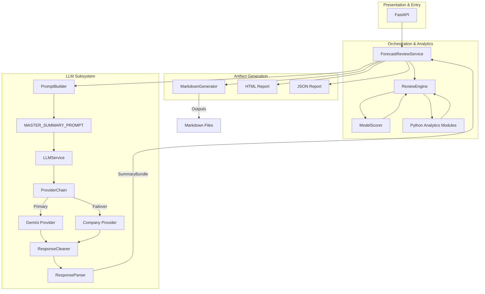

# Forecast Review & Decision Support System

## Project Overview

The **Forecast Review & Decision Support System** is a Teams-driven, API-backed, Python analytics application designed to evaluate existing forecasts, calculate risk, detect drift, and return a structured forecast review package. 

The core operational principle of the system is:
> **Python = Truth**  
> **LLM = Narrative**

All deterministic analytics, performance metrics, risk scorings, and comparisons are exclusively calculated by Python. The LLM subsystem operates purely as a provider-agnostic presentation layer, converting those structured facts into management-ready narratives without inferring or altering the underlying data.

---

## Key Features

- **Enterprise Decision Intelligence Engine:** `model_scorer.py` evaluates models using Absolute Scoring (Winsorized Min-Max), Wilcoxon confidence intervals, and volume segmentation to output a deterministic recommended model.
- **Provider-agnostic LLM Architecture:** Seamlessly swap LLM providers without altering core application code.
- **Enterprise Infrastructure Layer:** Decoupled `StorageManager`, `ExecutionContext` telemetry, and `ProviderRegistry` for robust dependency injection and observability.
- **Enterprise Resilience:** Integrated **Retry Policies** (exponential backoff with jitter) and **Circuit Breakers** to halt cascading failures.
- **Enterprise IV&V Audited:** Architecture and statistical methodologies have been independently verified for production readiness.
- **Single Master Prompt:** Replaces disjointed requests with a single consolidated JSON-enforcing prompt.
- **Response Cleaning & Strict JSON Parsing:** Edge-case robust JSON extraction and domain validation via Pydantic models.
- **FastAPI Presentation Layer:** Exposes a clean, RESTful API independent from the LLM subsystem.

---

## Updated Architecture Diagram



_Note: HTML, JSON, and FastAPI run independently from the LLM subsystem. If the LLM pipeline experiences a total outage, deterministic placeholders are generated and the standard reporting layers continue uninterrupted._

---

## Repository Structure

```text
forecast_review/
├── .env                        # Environment configurations (not checked in)
├── app.py                      # FastAPI application entry point
├── model_scorer.py             # Enterprise Decision Intelligence Engine
├── ivv_audit.py                # Verification & Validation harness
├── storage/                    # Infrastructure decoupling layer for I/O
├── config/
│   └── settings.py             # Strongly-typed environment variables & resilience configs
├── services/
│   ├── forecast_review_service.py
│   └── service_registry.py     # Dependency injection and ProviderRegistry integration
├── analytics/
│   ├── performance.py
│   ├── comparison.py
│   ├── drift.py
│   ├── risk.py
│   └── (other deterministic modules)
├── llm/
│   ├── llm_service.py          # Orchestrates prompts, LLM generation, cleaning, and parsing
│   ├── prompt_builder.py       # Assembles the MASTER_SUMMARY_PROMPT
│   ├── prompts.py              # Contains the MASTER_SUMMARY_PROMPT (and deprecated strings)
│   ├── llm_provider.py         # BaseLLMProvider interface & custom domain exceptions
│   ├── company_provider.py     # Internal LLM streaming endpoint integration
│   ├── provider_chain.py       # Implements failover logic across multiple providers
│   ├── provider_registry.py    # Factory binding Providers, Retries, and Circuit Breakers
│   ├── retry.py                # Exponential backoff and jitter policy
│   ├── circuit_breaker.py      # State machine preventing cascading failures
│   ├── response_cleaner.py     # Strips markdown wrappers from LLM outputs
│   └── response_parser.py      # Validates JSON against SummaryBundle schema
├── models/
│   ├── summary_models.py       # Domain models (ExecutiveSummary, SummaryBundle, etc.)
│   ├── provider_metrics.py     # Immutable structured metrics for observability
│   └── execution_models.py     # Internal state and flow models
├── reports/
│   ├── markdown_generator.py   # Generates `.md` files from SummaryBundles
│   ├── html_report.py
│   └── json_report.py
└── docs/                       # Project documentation
```

---

## Execution Pipeline

The complete execution sequence when a dataset is submitted:

1. **Dataset** upload via API
2. **ReviewEngine** validates data and triggers Python analytics
3. **ModelScorer** executes Decision Intelligence ranking (Winsorized Min-Max)
4. **ReviewResult** consolidated by ReviewEngine
5. **HTML Report** generated from ReviewResult
6. **JSON Report** generated from ReviewResult
6. **PromptBuilder** constructs context into `MASTER_SUMMARY_PROMPT`
7. **ProviderChain** executes API request with Circuit Breaker and Retry logic
8. **SummaryBundle** created after `ResponseCleaner` and `ResponseParser` validation
9. **MarkdownGenerator** formats the SummaryBundle
10. **Artifacts** saved to disk/SharePoint

---

## Configuration

All configuration is managed through `.env` and loaded securely via `config/settings.py`.

| Variable | Description |
|---|---|
| `LLM_PROVIDER` | *Legacy*. Defines the active provider if the chain is bypassed. |
| `PRIMARY_PROVIDER` | The first provider the `ProviderChain` will attempt (e.g., `gemini`). |
| `SECONDARY_PROVIDER` | The failover provider if the primary fails (e.g., `company`). |
| `GEMINI_MODEL` | The specific Google Gemini model to use (default: `gemini-2.5-pro`). |
| `GEMINI_API_KEY` | Authentication token for the Google Generative AI SDK. |
| `COMPANY_LLM_ENDPOINT` | The URL of the internal corporate LLM inference endpoint. |
| `COMPANY_MODEL` | The specific local/internal model to use (default: `llama3.1:8b`). |
| `MAX_RETRIES` | Max exponential backoff attempts for transient API errors (default: `3`). |
| `CIRCUIT_BREAKER_FAILURE_THRESHOLD` | Number of sequential failures before the circuit opens and instantly fails over (default: `3`). |
| `CIRCUIT_BREAKER_RESET_TIMEOUT_SECONDS` | Time in seconds before an `OPEN` circuit attempts a `HALF_OPEN` probe (default: `30`). |

---

## Running

### CLI & Standard Execution
Run the standard pipeline against a sample dataset:
```bash
python app.py sample_data/FinalForecast_Imputed.xlsx
```

### FastAPI & Swagger
Start the local ASGI development server:
```bash
uvicorn api.main:app --reload
```
Access the Swagger UI at: `http://localhost:8000/docs`

---

## Testing

Execute the test suite using `pytest`:
```bash
pytest tests/
```
To verify the resilience layer specifically (simulating network outages and failovers):
```bash
python verify_resilience.py
```

---

## Future Roadmap

- Fully containerize the application (Docker readiness).
- Implement database-backed governance (SQL Server / PostgreSQL) to replace SharePoint MVP storage.
- Introduce advanced, multi-week forecast trend comparisons.
- Implement an interactive forecast assistant (chat interface) utilizing the same strict JSON Prompt architecture.
